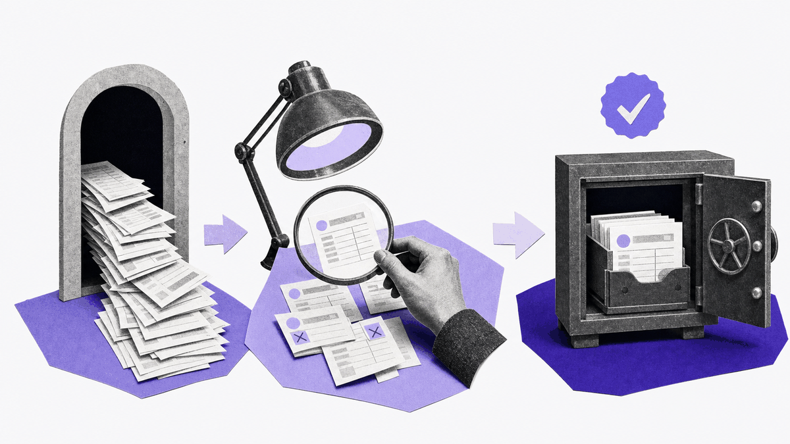
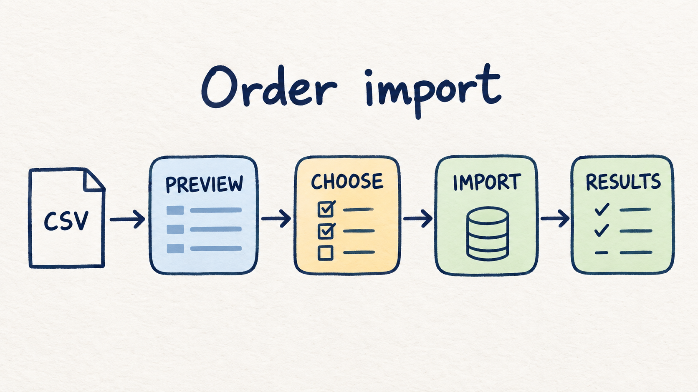

# Build a dependable order import service with Clasp



Thanks for making time for this exercise. We’re looking forward to seeing how you approach a practical problem and check your work.

A teammate receives order exports from a partner. They need to review each file, choose what to import, and understand what was saved. Build a small HTTP service to help them do that confidently.

**Spend about four hours.** Focus on the three core tasks below. Use your preferred language and libraries; no frontend, deployment, authentication, or AI feature is required. If you run out of time, tell us what’s unfinished. Questions? Email [technologyhiring@clasp.com](mailto:technologyhiring@clasp.com).

## Build these three things



1. **Preview the file.** Accept a CSV and show which rows are ready, invalid, duplicates, or already stored, with helpful explanations. Previewing must not change orders. You may reject a problematic file as a whole if you explain what needs fixing.
2. **Import the chosen orders safely.** Let the caller select rows from that preview. Save only approved, valid orders; preserve existing records and IDs. Identical resends should not create duplicates, and conflicting values must not overwrite an order.
3. **Make the result trustworthy.** Explain what happened to every row, including unselected rows. Repeating an approval must be safe, and a corrected upload must work after an invalid one. Add meaningful tests and clear run instructions.

The short [API contract](API_CONTRACT.md) provides the request and response shapes. A CLI or HTTP client is enough to demonstrate the flow.

## The data rules

- An order’s identity is `source` + `external_order_id`, both case-sensitive. Trim surrounding whitespace in fields; preserve remaining identifier and email text exactly.
- All seven CSV fields are required. Use nonblank emails, real `YYYY-MM-DD` dates, currencies `USD`/`EUR`/`GBP`, and statuses `pending`/`paid`/`shipped`/`cancelled`.
- Store money as integer minor units: `12.50` becomes `1250`. Accept unsigned decimals with up to two decimal places, including zero, up to `2^53 - 1` minor units. Reject negative, ambiguous, or over-precise amounts rather than rounding or guessing.
- Support ordinary UTF-8 CSV, quoted commas and escaped quotes. Explain malformed input. Identical orders may be skipped; changed values for an existing identity are conflicts, including email-case changes.

## Get started

`data/` contains a SQLite database with 12 fictional orders and two sample CSVs. Keep these originals unchanged and use a working database copy. You may extend the schema while preserving the existing columns, values, and IDs.

Configure the service with `PORT` and `ORDERS_DB`. The public smoke check exercises a small core workflow:

```sh
python3 smoke.py --url http://127.0.0.1:8000 --db /path/to/working.db
```

Run it against a disposable database, alongside your own tests.

## If you have time

Choose a stretch that interests you: **1. competing requests; 2. interrupted imports; 3. input boundaries.** The [optional appendix](STRETCHES.md) has concrete suggestions. These are not required for a complete core submission; skipping them is not a deduction. Stay within the timebox.

## Using AI tools

We use AI in our work at Clasp, and we’re looking for engineers who use it thoughtfully to produce great work. You’re welcome to use it throughout this exercise—for planning, implementation, tests, and review.

**Use AI freely within the guidelines below, and own the result.** Understand the code you submit, check suggestions against actual behavior, and be ready to explain your tradeoffs, debug a problem, or make a change. We’re interested in where AI helped, what you challenged or corrected, and what you verified yourself.

These are the allowed closed-source models:

| Provider | Allowed models |
| --- | --- |
| **Anthropic — Claude** | **Sonnet** and **Haiku**, e.g. Claude Sonnet 5 (`claude-sonnet-5`) or Claude Haiku 4.5 (`claude-haiku-4-5`) |
| **OpenAI — GPT** | **Terra** and **Luna**, e.g. GPT-5.6 Terra (`gpt-5.6-terra`), GPT-5.6 Luna (`gpt-5.6-luna`), or GPT-6 Luna (`gpt-6-luna`) |
| **Google — Gemini** | **Gemini 3.8 Flash** (`gemini-3.8-flash`) and **Gemini 3.1 Pro Preview** (`gemini-3.1-pro-preview`) |

**Any open-source model is allowed.** ChatGPT, Codex, Claude Code, and Gemini CLI are tools/interfaces; check the selected model. The allowlist also applies to reviewers, subagents, and fallbacks. If your model’s identity is unclear, ask before using it.

In your handoff, list every tool/harness and model used, its provider, exact model ID/version and settings when known, and what it helped with—including review. Mention switches or accidental use outside the list; mark unavailable details `unknown`. Summarize what you checked yourself. No full transcripts are needed.

Model references: [Anthropic](https://platform.claude.com/docs/en/models/overview), [OpenAI](https://developers.openai.com/api/docs/models/all), [Google](https://ai.google.dev/gemini-api/docs/models).

## Hand it over

Leave a short README with setup/start/test/reset commands, assumptions, tests actually run, known limitations, and AI disclosure. We review correctness, recovery, test quality, code clarity, and handoff against the core scope. Optional stretch work is discussed separately.

Create a **private** repository from this template. Keep `main` at the starting template, commit your work on `submission`, invite **StrideTechHiring**, and open an **unmerged PR** to `main`. Reply with **READY FOR REVIEW**, your GitHub username, repository URL, and PR URL. Keep the submitted commit unchanged until we confirm receipt.

Thanks again—we’re looking forward to discussing your approach.
